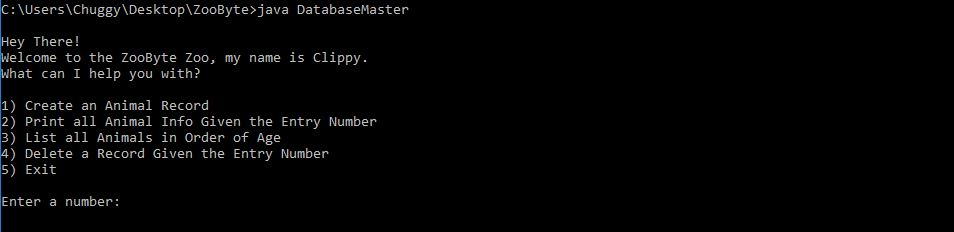
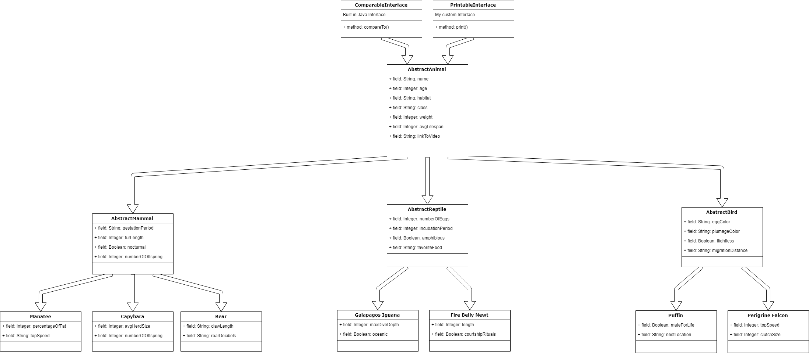

# ZooByte

This is an **extremely** simple text based zoo database built in java. Created to further my understanding of
OOP concepts.

### Prerequisites

[Java](https://www.oracle.com/technetwork/java/javase/downloads/index.html) & [Java Development Kit](https://www.oracle.com/technetwork/java/javase/downloads/index.html)

```
Give examples
```

### Installing & Running

Clone this repo...
```
git clone https://github.com/OliverMathias/ZooByte
```

'cd' into the folder and compile the java code...
```
javac *.java
```

Run the DatabaseMaster file...
```
java DatabaseMaster
```

Follow the prompts...


### Diagram



## License

This project is licensed under the MIT License.
